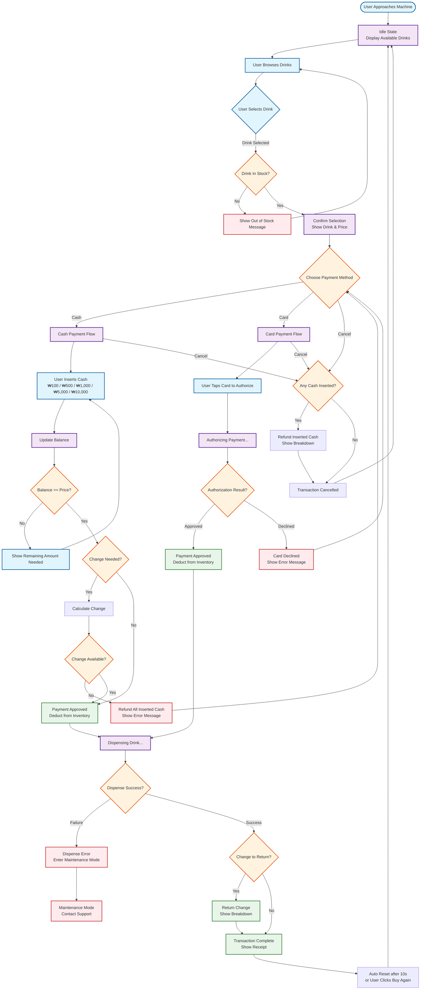

# Vending Machine Flow Diagram

This diagram illustrates the complete user journey and machine state transitions for the vending machine system, covering all scenarios from drink selection to completion or error handling.

## Flow Description

### Main Flow
1. **Idle State**: Machine displays available drinks (Cola ₩1,100, Water ₩600, Coffee ₩700)
2. **Selection**: User selects a drink → Machine checks stock availability
3. **Payment Method**: User chooses Cash or Card payment
4. **Payment Processing**: 
   - **Cash**: Insert denominations → Balance check → Change calculation
   - **Card**: Tap card → Authorization → Approval/Decline
5. **Dispensing**: Machine dispenses drink after successful payment
6. **Completion**: Return change (if any) → Show receipt → Auto-reset

### Error Scenarios
- **Out of Stock**: User selects unavailable drink → Show message → Return to browsing
- **Insufficient Change**: Cash payment but machine cannot provide change → Refund all cash → Return to payment selection
- **Card Declined**: Authorization fails → Show error → Return to payment selection
- **Dispense Failure**: Hardware error → Enter maintenance mode

### Cancellation Flow
- User can cancel at payment selection
- If cash inserted, machine refunds all inserted cash with breakdown
- Returns to idle state

## Key Features Covered

✅ **Payment Methods**: Cash (₩100-₩10,000) and Card payments  
✅ **Drink Inventory**: Cola, Water, Coffee with stock tracking  
✅ **Change Handling**: Automatic calculation and return  
✅ **Error Handling**: Out of stock, change shortage, card decline, dispense failure  
✅ **Cancellation**: Full refund with breakdown  
✅ **User Experience**: Clear messaging at each step  

## State Machine States

- `idle`: Ready for next customer
- `awaitingPayment`: Waiting for payment method selection
- `processingPayment`: Card authorization in progress
- `dispensing`: Drink being dispensed
- `refund`: Returning cash/change
- `complete`: Transaction finished
- `maintenance`: Machine error requiring support
